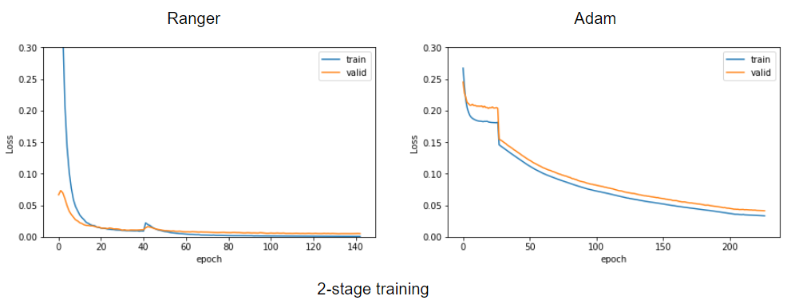

# bias-mitigation-for-age-detection

A machine learning competition on [CodaLab](https://codalab.lisn.upsaclay.fr/competitions/7210).

## Task
Estimating the age from images while mitigating the bias in protected attributes (age, gender, ethnicity, facial expression)

# Data Augmentation

# Custom Loss

# Optimizer

# Results
